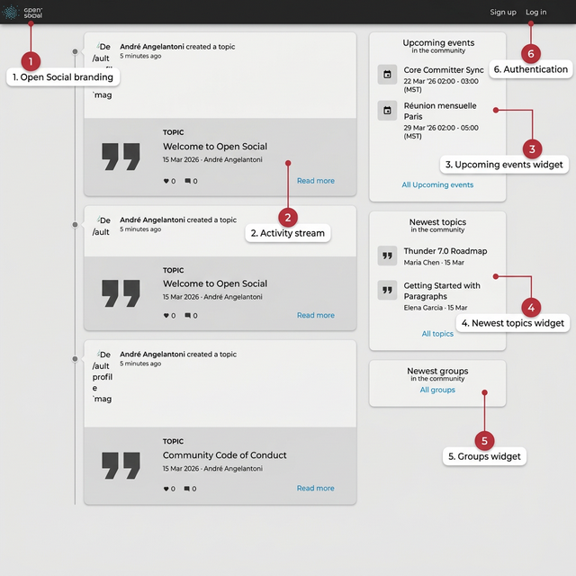
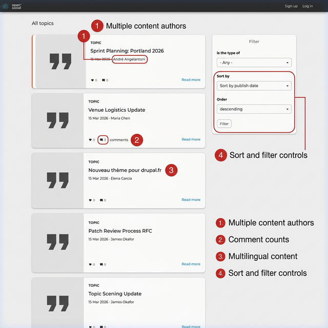
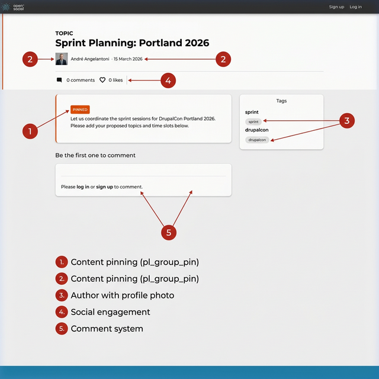
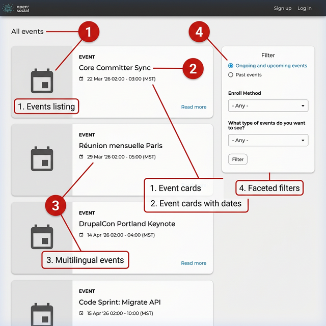

# Feature Tour

A visual walkthrough of the platform's most important capabilities — both the Open Social foundation and custom Performant Labs extensions.

> Screenshots taken from the live production site at [opensocial.performantlabs.com](https://opensocial.performantlabs.com).

---

## Homepage & Activity Stream

The homepage is the central hub, showing a chronological activity stream of recent community content alongside sidebar widgets for quick discovery.

**Key elements:**

1. **Open Social branding** — The SocialBlue theme provides a clean, modern interface
2. **Activity stream** — Topics, events, and other content appear as cards with author avatars, dates, like/comment counts, and "Read more" links
3. **Upcoming events widget** — Shows the next community events with dates and times
4. **Newest topics widget** — Highlights recent discussion topics from any author
5. **Newest groups widget** — Links to the groups listing for exploration
6. **Authentication** — Sign up and Log in links for community access

---

## Topics

Topics are the primary discussion format. Users write rich-text posts, tag them with taxonomy terms, and post them to one or more groups.

### Topics Listing

The All Topics page shows every topic across the community with filtering and sorting controls.

**Key elements:**

1. **Multiple content authors** — Topics are created by different community members (André Angelantoni, Maria Chen, Elena Garcia, James Okafor)
2. **Comment counts** — Each topic card shows engagement metrics (e.g., "Venue Logistics Update" has 3 comments)
3. **Multilingual content** — Topics can be written in any language (e.g., "Nouveau thème pour drupal.fr" in French)
4. **Sort and filter controls** — Filter by content type, sort by publish date, and order ascending/descending

### Topic Detail

Individual topic pages show the full content with social features.

**Key elements:**

1. **Content pinning** — The `pl_group_pin` module lets group managers pin topics with a "PINNED" badge, keeping important content at the top of the stream
2. **Author with profile photo** — AI-generated profile photos give the community a human feel
3. **Taxonomy tagging** — Topics are tagged with terms (sprint, drupalcon) displayed in a sidebar, enabling cross-referencing
4. **Social engagement** — Comment and like counters encourage interaction
5. **Comment system** — Threaded comments with login prompts for anonymous visitors

---

## Events

Events have start/end dates, enrollment management, capacity limits, and type classification.

**Key elements:**

1. **Events listing** — Dedicated page for all community events
2. **Event cards with dates** — Each event shows its date/time range at a glance
3. **Multilingual events** — Events like "Réunion mensuelle Paris" demonstrate French-language community activity
4. **Faceted filters** — Filter by ongoing/past events, enrollment method, and event type (DrupalCon, Sprint, DrupalCamp, etc.)

Event types from the demo data include:
- DrupalCon Portland Keynote (capacity: 500)
- Code Sprint: Migrate API (capacity: 30)
- Réunion mensuelle Paris (open enrollment)
- Core Committer Sync (weekly)
- DrupalCamp Barcelona (16-hour multi-day)

---

## Groups

All groups use the **Flexible Group** bundle with configurable visibility and join methods. Groups require authentication to view.

### Visibility levels

| Level | Behavior | Example |
|---|---|---|
| **Public** | Anyone can view group content | DrupalCon Portland 2026 |
| **Community** | Only logged-in users can view | Most working groups |
| **Members** | Only group members can view | Leadership Council |

### Join methods

| Method | Behavior | Example |
|---|---|---|
| **Direct** | Users join instantly | Drupal France |
| **Added** | Invitation-only by managers | Core Committers, Leadership Council |
| **Request** | Users submit a request for approval | elena_garcia → Core Committers |

### Group types

Groups are categorized by taxonomy: **Geographical** (Drupal France), **Working Group** (Core Committers), **Distribution** (Thunder), **Event Planning** (DrupalCon Portland), and **Archive** (Legacy Infrastructure).

### Custom group features

| Module | Feature |
|---|---|
| `pl_group_language` | Sets interface language based on group context (e.g., Drupal France → French UI) |
| `pl_group_mission` | Displays group description as a sidebar block on all group pages |
| `pl_group_pin` | Lets managers pin topics above the chronological stream |
| `pl_group_extras` | Archive enforcement and submission guidelines |

---

## Multi-Group Posting

The `pl_multigroup` module allows a single Topic or Event to belong to multiple groups simultaneously. For example, "Thunder 7.0 Roadmap" appears in both Thunder Distribution and DrupalCon Portland 2026 without content duplication.

---

## User Profiles

Each user has a profile with name, organization, function, self-introduction, summary, and profile photo.

### Contribution statistics

The `pl_profile_stats` module adds a statistics block showing: topics authored, comments made, events created, and group memberships.

### Profile completeness

Users without a photo or self-introduction (e.g., alex_novak) are prompted to complete their profile.

### Demo users

| User | Role | Organization | Language |
|---|---|---|---|
| André Angelantoni (admin) | Platform Director | Performant Labs | English |
| Maria Chen | Content Manager | Community Builders Inc | English |
| James Okafor | Site Manager | DevOps Solutions Ltd | English |
| Elena Garcia | Developer Advocate | Open Source Collective | Spanish |
| Sophie Müller | Frontend Developer | Digitale Agentur Berlin | German |
| Ravi Patel | *(incomplete profile)* | | English |
| Alex Novak | *(minimal — no photo)* | | English |

---

## Discovery & Content Surfacing

The `pl_discovery` module provides:

- **Hot content scoring** — Algorithmic ranking based on recency, comments, and likes
- **Promoted content** — `promote_homepage` flag features content on the homepage
- **Tags aggregation view** — Browse content by taxonomy tag
- **Per-group RSS feeds** — Each group exposes an RSS feed
- **iCal feeds** — Calendar events exportable as iCal

---

## Multilingual Support

**15 languages configured:** English, German, Spanish, French, Italian, Japanese, Korean, Dutch, Polish, Portuguese, Russian, Turkish, Ukrainian, Chinese (Simplified), and Arabic.

- **User preferences** — Each user sets a preferred language; notifications render in their language
- **Content translation** — Topics and Events can be translated
- **Group-level switching** — `pl_group_language` overrides interface language per group

---

## Notifications

- **Core:** New content in groups, comments on authored content, @mentions, enrollment updates, membership changes
- **`pl_notifications`:** Per-post opt-out and centralized subscription management page

---

## Wiki Links

The `pl_opensocial_wiki` module enables `[[Title]]` syntax in topic bodies. When rendered, these become clickable links to matching topics — linking knowledge without manual URL management.

---

## Technical Stack

| Component | Version |
|---|---|
| Drupal core | 10.6.x |
| Open Social | 13.0.0 |
| PHP | 8.3 |
| Database | MariaDB 11.8 |
| Theme | SocialBlue |
| Deployment | Docker (PHP-FPM + MariaDB) behind host nginx |

### Custom modules summary

| Module | Purpose |
|---|---|
| `pl_discovery` | Hot scoring, promoted content, iCal/RSS feeds, tag views |
| `pl_group_extras` | Archive enforcement, submission guidelines |
| `pl_group_language` | Group-level interface language switching |
| `pl_group_mission` | Group mission statement sidebar block |
| `pl_group_pin` | Pin topics to top of group stream |
| `pl_multigroup` | Post content to multiple groups |
| `pl_notifications` | Per-post opt-out, subscription management |
| `pl_opensocial_wiki` | `[[Title]]` wiki-style linking |
| `pl_profile_stats` | Contribution stats and completeness indicator |
